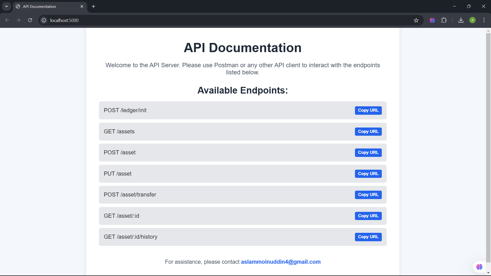
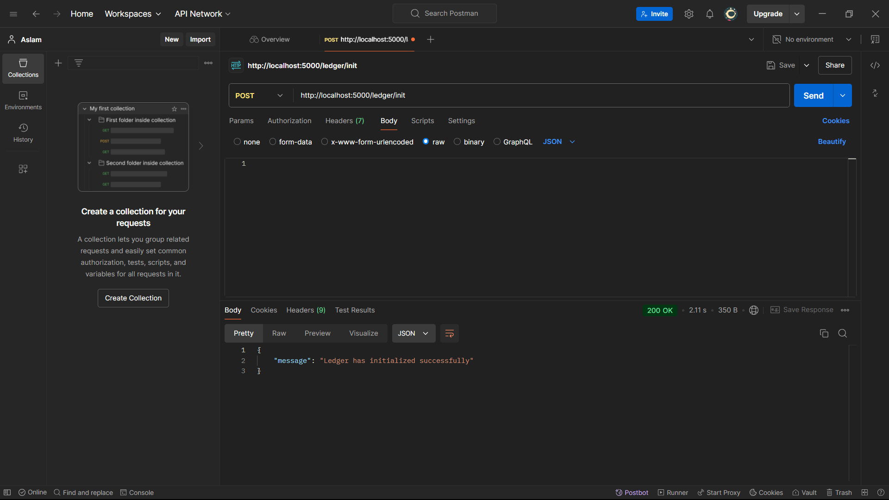
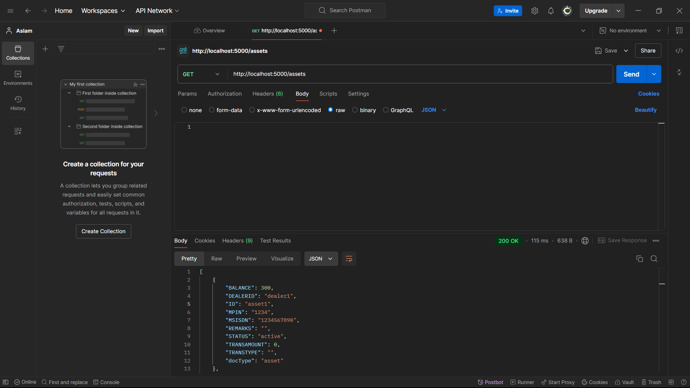

Blockchain-Based Asset Management System
========================================

This project implements a blockchain-based asset management system for a financial institution, enabling secure and immutable tracking of assets. The system supports creating, updating, reading, and transferring assets, and retrieving transaction histories for enhanced transparency and security.

Features
--------

*   **Asset Creation**: Initialize new assets with specific attributes.
    
*   **Update Asset**: Modify attributes of existing assets.
    
*   **Read Asset**: Query details of a particular asset.
    
*   **Transfer Asset**: Change ownership of assets.
    
*   **Asset History**: Track the transaction history for each asset.
    
*   **Ledger Initialization**: Initialize the ledger with default assets.
    

Prerequisites
-------------

1.  [Node.js](https://nodejs.org) (for running the application server)
    
2.  [Hyperledger Fabric](https://hyperledger-fabric.readthedocs.io) (for setting up the blockchain network)
    

Project Structure
-----------------

*   **assetTransfer.js**: Smart contract logic implemented on Hyperledger Fabric.
    
*   **app.js**: Express server to interact with the Fabric network and expose RESTful APIs.
    

Installation and Setup
----------------------

1.  
    ```bash
    codegit clone cd
    ```
    
2.  ```bash
    codenpm install
    ```
    
3.  Set up the Hyperledger Fabric network as per Fabric documentation.
    
4.  Update configuration variables in app.js as necessary for your environment, such as:
    
    *   CHANNEL\_NAME
        
    *   CHAINCODE\_NAME
        
    *   MSP\_ID
        
    *   PEER\_ENDPOINT
        
5.  
    ```bash
    codenode app.js
    ```
    

## API Endpoints

| **Endpoint**                    | **Method** | **Description**                                 | **Body Parameters**                                         |
|---------------------------------|------------|-------------------------------------------------|-------------------------------------------------------------|
| `/ledger/init`                  | POST       | Initializes the ledger with sample asset data.  | None                                                        |
| `/asset`                        | POST       | Creates a new asset with specified details.     | `id`, `dealerId`, `msisdn`, `mpin`, `balance`, `status`, `transAmount`, `transType`, `remarks` |
| `/assets`                       | GET        | Retrieves all assets in the ledger.             | None                                                        |
| `/asset/:id`                    | GET        | Retrieves details of a specific asset by ID.    | None                                                        |
| `/asset`                        | PUT        | Updates details of an existing asset.           | `id`, `dealerId`, `msisdn`, `mpin`, `balance`, `status`, `transAmount`, `transType`, `remarks` |
| `/asset/transfer`               | POST       | Transfers ownership of an asset.                | `id`, `newOwner`                                            |
| `/asset/:id/history`            | GET        | Retrieves the transaction history of a specific asset by ID. | None                                                        |
   
 

Example Usage
-------------

1.  **Initialize Ledger**: POST /ledger/init
    ```bash 
    codecurl -X POST http://localhost:5000/ledger/init
    ```
     
    
2.  **Create Asset**:
    ```bash
    curl -X POST http://localhost:5000/asset \
    -H "Content-Type: application/json" \
    -d '{ 
        "id": "asset1", 
        "dealerId": "dealer1", 
        "msisdn": "1232338855", 
        "mpin": "5648", 
        "balance": 4500, 
        "status": "active", 
        "transAmount": 120, 
        "transType": "", 
        "remarks": ""
    }'

    
3.  **Get All Assets**:GET /assets 
    ```bash
    codecurl http://localhost:5000/assets
    ```
     
    
4.  **Transfer Asset**: POST /asset/transfer
    ```bash
    codecurl -X POST http://localhost:5000/asset/transfer \
    -H "Content-Type: application/json" \
    -d '{ 
        "id": "asset3",
        "newOwner": "dealer4"
    }'
    ```
    

License
-------

This project is licensed under the Apache License 2.0.

Contact
-------

For questions, please contact the developer at [aslammoinuddin4@gmail.com](mailto:aslammoinuddin4@gmail.com).
